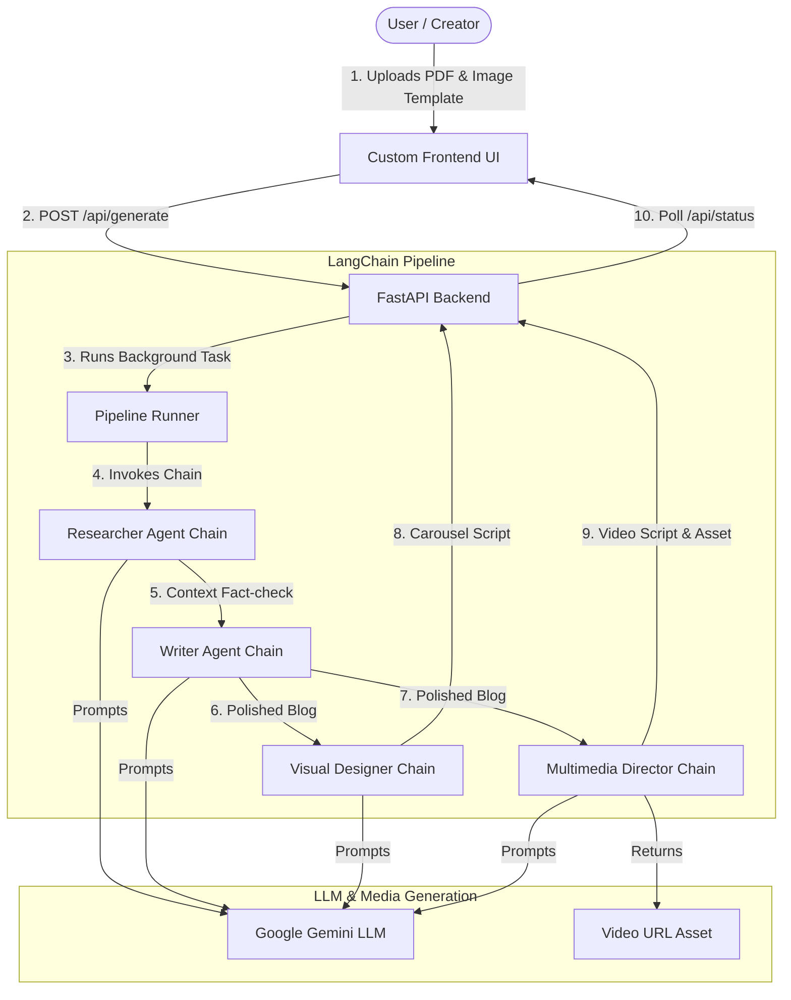

# 🚀 Content Studio: Agentic Multi-Channel Content Engine
**Architectural Blueprint & User Guide**

Welcome to the **Agentic Multi-Channel Content Engine (Content Studio)**. Content Studio is an autonomous content orchestration system designed to ingest complex research documents (PDFs), visual template layouts, and text drafts to perform agent-based validation and generate ready-to-publish assets for multiple channels (Blog, Social Media Carousels, and Video).

---

## 🗺️ System Architecture

Content Studio is designed with a lightweight, high-performance architecture utilizing **FastAPI** to serve both the REST API and the Glassmorphism-style frontend, and **LangChain** to coordinate the multi-agent execution pipeline.



---

## 🤖 Agentic Pipeline & Core Roles

The generation pipeline is built with sequential LangChain runnables, executing the following specialized personas in order:

| Agent Persona | Role | Primary Model | Input | Output |
| :--- | :--- | :--- | :--- | :--- |
| **Lead Researcher** | Fact-checking, source validation, and context extraction | `gemini-1.5-flash` | User raw text + PDF context | A structured summary of facts |
| **Content Architect** | Writing long-form blog posts matching a style tone sample | `gemini-1.5-flash` | Original draft + style sample + researcher report | A polished Markdown blog post |
| **Visual Strategist** | Designing slides and layouts for social media carousels | `gemini-1.5-flash` | Polished blog post + optional template path | Slide-by-slide titles and visual prompts |
| **Multimedia Director**| Scripting narration and providing video asset sequences | `gemini-1.5-flash` | Polished blog post | Narrator script synced with video stream URLs |

---

## 🔌 API Documentation

### 1. File Upload: `POST /api/upload`
Uploads PDFs or image templates to the local storage.
* **Request:** Multipart Form (`file`)
* **Response:**
  ```json
  { "pdf_path": "uploads/filename.ext" }
  ```

### 2. Generate Content: `POST /api/generate`
Triggers the background agent execution.
* **Request Schema:**
  ```json
  {
    "source_text": "string (optional draft)",
    "pdf_path": "string (optional uploaded PDF path)",
    "style_sample": "string (optional writing tone reference)",
    "channels": ["blog", "carousel", "video"],
    "template_path": "string (optional uploaded template image path)"
  }
  ```
* **Response Schema:**
  ```json
  {
    "task_id": "string (UUID)",
    "status": "pending"
  }
  ```

### 3. Execution Status: `GET /api/status/{task_id}`
Retrieves active agent execution progress and final generation assets.
* **Response Schema:**
  ```json
  {
    "task_id": "string",
    "status": "pending | processing | completed | failed",
    "current_agent": "Lead Researcher",
    "progress_percentage": 60,
    "artifacts": {
      "blog_post": "string (Markdown)",
      "carousel": "string (Carousel slides)",
      "video": {
        "script": "string (Video script)",
        "video_url": "string (MP4 stream URL)"
      }
    }
  }
  ```

---

## 🏃 Getting Started

### 1. Clone & Set Up Environment
Create a virtual environment and install the required dependencies:
```bash
python -m venv venv
source venv/bin/activate
pip install -r requirements.txt
```

### 2. Configure Environment Variables
Create a `.env` file in the root directory:
```env
GEMINI_API_KEY=your_gemini_api_key_here
```

### 3. Start the Application
Run the FastAPI development server:
```bash
uvicorn main:app --reload --host 127.0.0.1 --port 8000
```
Open **http://127.0.0.1:8000** in your browser to view the interactive dashboard.

---

## 🔄 Recent Updates

- **2026-06-08:** Clarified setup and added quick-start notes; minor editorial improvements.
 
---

## Overview

Content Studio (content-engine) is a lightweight agentic content pipeline that ingests documents, images, videos, and text, extracts context (OCR, transcripts, page text), and coordinates LLM-driven chains to produce publishable assets: blog posts, social carousels, and video scripts.

The repo includes a small FastAPI app that exposes an `/ingest` endpoint which accepts a list of assets and returns collected, processed assets ready for downstream generation.

## Key Features

- Ingest images, PDFs, videos, and text and extract usable text content.
- OCR from images and embedded PDF images via `pytesseract`.
- Simple LLM wiring via `langchain-google-genai` and prompt templates for research, writing, design, and multimedia.
- Clear Pydantic models for assets and generation outputs.

## Quick Start

1. Create and activate a virtualenv:

```bash
python -m venv venv
source venv/bin/activate
pip install -r requirements.txt
```

2. Set environment variables (create a `.env` file):

```env
# Example
GEMINI_API_KEY=your_gemini_api_key_here
```

3. Run the FastAPI server:

```bash
uvicorn main:app --reload --host 127.0.0.1 --port 8000
```

4. POST assets to the `/ingest` endpoint. Example payload:

```json
[
  {"id":"1","type":"document","path":"/path/to/doc.pdf"},
  {"id":"2","type":"image","path":"/path/to/image.jpg"}
]
```

## Project Structure

- `main.py` — FastAPI app and `/ingest` endpoint.
- `llm/llm.py` — LLM client and model constants.
- `llm/prompts/` — Prompt templates: `designer_prompt.py`, `multimedia_prompt.py`, `research_prompt.py`, `writer_prompt.py`.
- `models/Asset.py` — `Asset` Pydantic model for incoming assets.
- `models/llm_output.py` — Output models for generation results.
- `models/Processed_Assests.py` — Processed asset models and containers.
- `utils/Ingestor.py` — Image/PDF/video/text processing, OCR helpers, and merging logic.
- `requirements.txt` — Python dependencies.

## How It Works (high level)

1. The `/ingest` endpoint receives an array of `Asset` objects.
2. `utils/Ingestor` processes each asset type and returns a `ProcessedAssets` object containing extracted text, page images, and placeholders for video keyframes/transcripts.
3. Downstream LLM chains (prompts in `llm/prompts`) consume `ProcessedAssets` to produce structured outputs (refined blog, image scenes, video script).

## Future Roadmap

- Add generation orchestration endpoints: `POST /generate` and `GET /status/{task_id}` for background runs.
- Integrate full LangChain agents for sequential orchestration and retries.
- Add unit and integration tests for ingestion and LLM prompt outputs.
- Containerize with Docker + Docker Compose for local dev and CI.
- Add CI pipeline (GitHub Actions) to run tests and linting.
- Add optional S3-compatible storage for uploaded assets and generated artifacts.
- Add a minimal web frontend to upload assets and view generation artifacts.
- Improve video processing: extract keyframes, integrate speech-to-text for transcripts.
- Add configurable prompt tuning and per-channel templates (blog, carousel, video).

---

If you'd like a different tone, more detail in any section, or a badge set (license, CI), tell me which and I'll add it.
