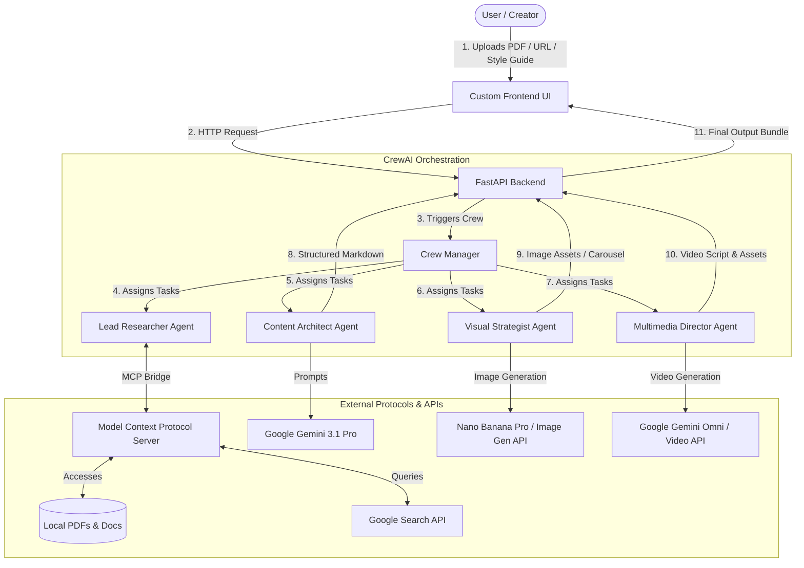

# 🚀 AMCE: Agentic Multi-Channel Content Engine
**Architectural Blueprint & Implementation Guide**

Welcome to the **Agentic Multi-Channel Content Engine (AMCE)**. AMCE is an autonomous content orchestration system designed to ingest complex research (like PDFs or web articles), perform deep validation, and generate ready-to-publish assets for multiple channels (Blog, Social Media Carousels, and Video).

This document serves as the **Senior AI Architect Blueprint** for building AMCE. It outlines the architecture, patterns, protocol integrations, and schemas needed to implement the platform.

---

## 🗺️ System Architecture

AMCE is designed as a multi-agent system orchestrated using **CrewAI**, with a **FastAPI** backend and a custom user interface.



---

## 🤖 Agentic Workflow & Design Patterns

### 1. Hierarchical vs. Sequential Workflows
When designing multi-agent systems in frameworks like CrewAI, two main patterns emerge:
*   **Sequential Workflow:** Tasks are executed one after the other in a linear pipeline. The output of Task A becomes the input of Task B. This is simple but rigid.
*   **Hierarchical Workflow (Recommended for AMCE):** A "Manager Agent" oversees the process. The manager decomposes the user request, delegates tasks to specialist agents, reviews their outputs, and sends tasks back for revision if they don't meet quality standards. This allows for dynamic error correction and human-in-the-loop validation.

### 2. The AMCE Crew Roles
To build the content engine, you will define four distinct agent personas. Note that you must write their system prompts and backstories to instill the necessary domain expertise.

| Agent Persona | Role | Primary Model | Input | Output | Tools |
| :--- | :--- | :--- | :--- | :--- | :--- |
| **Lead Researcher** | Fact-checking, source validation, and context gathering | `gemini-3.1-pro` | User PDF, URL, or topic prompt | A structured "Source of Truth" document | Local PDF Reader, Web Search MCP tool |
| **Content Architect** | Long-form blog writing and style mimicry | `gemini-3.1-pro` | Source of Truth document + User Style Guide | Localized markdown blog post with reference citations | Style-analyzer tool (few-shot prompting) |
| **Visual Strategist** | Designing slides for social media carousels | `nano-banana-pro` or equivalent | Section breakdown of the blog post | 5-10 slide scripts with image descriptions and overlay text | Image generation API tool |
| **Multimedia Director**| Orchestrating and producing short video sequences | `gemini-omni` | Blog summary and key quotes | Video storyboard, synchronized audio script, and visual prompt sequence | Video rendering API tool |

---

## 🔌 Model Context Protocol (MCP) Integration

The **Model Context Protocol (MCP)** is an open standard designed to connect LLMs to data sources and tools securely. Instead of building bespoke API integrations for every service, you build an MCP server that exposes capabilities, and the model (or agent orchestrator) acts as the client.

For AMCE, the MCP bridge allows the Lead Researcher to:
1.  **Read Local Files:** Safely parse uploaded PDFs and text documents without overloading the core context window unnecessarily.
2.  **Perform Web Search:** Run live search queries to verify facts or gather the latest news (e.g., verifying developments in Hyderabad's AI City as of mid-2026).

```
+-------------------------------------------------------------+
|                        MCP Client                           |
|       (FastAPI backend / CrewAI Orchestrator Agent)        |
+------------------------------------+------------------------+
                                     |
                                     | JSON-RPC (stdio/SSE)
                                     v
+------------------------------------+------------------------+
|                        MCP Server                           |
|  - Filesystem Tool (list_dir, read_file)                   |
|  - Web Search Tool (brave-search, google-search)           |
+-------------------------------------------------------------+
```

---


## 🛠️ FastAPI Backend Blueprint

Your FastAPI backend serves as the bridge between your Frontend UI and the CrewAI engine. Below are the key endpoints and schemas you need to implement.

### Endpoint: `/api/generate` (POST)
Starts the content generation process.
*   **Request Schema:**
    ```json
    {
      "source_text": "string (optional raw text prompt)",
      "pdf_path": "string (optional path to uploaded PDF)",
      "style_sample": "string (sample text to mimic writing style)",
      "channels": ["blog", "carousel", "video"]
    }
    ```
*   **Response Schema:**
    ```json
    {
      "task_id": "string (UUID for polling progress)",
      "status": "pending"
    }
    ```

### Endpoint: `/api/status/{task_id}` (GET)
Polls the execution progress of the agents.
*   **Response Schema:**
    ```json
    {
      "task_id": "string",
      "status": "processing | completed | failed",
      "current_agent": "Lead Researcher",
      "progress_percentage": 45,
      "artifacts": {
        "blog_post": "string (markdown content or null)",
        "carousel": "object (slides and images or null)",
        "video": "object (storyboard and video links or null)"
      }
    }
    ```

---

## 🚶 Step-by-Step Student Implementation Guide

To maintain academic integrity and complete the IBM certification successfully, follow these steps to build the AMCE codebase manually:

### Step 1: Virtual Environment & Core Packages
Set up a clean environment and install dependencies:
```bash
python -m venv venv
source venv/bin/activate
pip install fastapi uvicorn crewai google-generativeai pydantic
```

### Step 2: Establish the MCP Config
Configure your local MCP server to enable file and search access for your agents. You can create a simple local Node or Python-based MCP server.
*   File path: `mcp-config.json`

### Step 3: Implement Your Agents (`agents.py`)
Define your CrewAI agents. Ensure you specify their `role`, `goal`, `backstory`, and assign the relevant tools. Remember to craft original prompt backstories that guide the agents toward high-quality output and style alignment.

### Step 4: Write Custom Tools (`tools.py`)
Implement the functions that let your agents interact with external APIs. For example, write a tool that takes a slide prompt and calls an image generator (like Pollinations.ai or a local Stable Diffusion server) to return an image URL.

### Step 5: Construct the FastAPI Application (`main.py`)
Build the web server, define the schemas using Pydantic, and implement the endpoints to initiate the CrewAI execution asynchronously (e.g., using background tasks).

### Step 6: Design the Frontend (`ui/`)
Create a dashboard that allows users to upload documents, customize the style inputs, and view the generated blog posts, social carousels, and videos side-by-side.

---

## 💡 Syntax Snippets for Reference

Here are reference snippets to assist you with the syntax of the libraries used in this project.

### 1. Initializing the Gemini Model with CrewAI
```python
# Reference for integrating Google's Gemini models with CrewAI
from langchain_google_genai import ChatGoogleGenerativeAI

gemini_llm = ChatGoogleGenerativeAI(
    model="gemini-3.1-pro",
    google_api_key="YOUR_API_KEY"
)
```

### 2. Defining a CrewAI Agent Stub
```python
# Syntax for defining an agent with specific goals and models
from crewai import Agent

researcher = Agent(
    role="Lead Researcher",
    goal="Gather and verify information on the given topic",
    backstory="You are a detailed research analyst specializing in tech innovation.",
    llm=gemini_llm,
    verbose=True
)
```

### 3. FastAPI Background Tasks
```python
# Running the long-running CrewAI execution in the background
from fastapi import FastAPI, BackgroundTasks

app = FastAPI()

@app.post("/generate")
def generate_content(background_tasks: BackgroundTasks):
    background_tasks.add_task(run_crew_execution)
    return {"status": "started"}
```